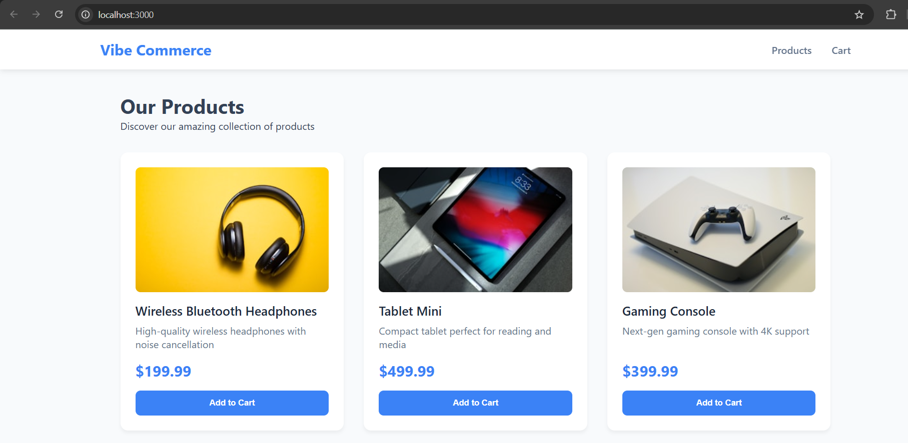
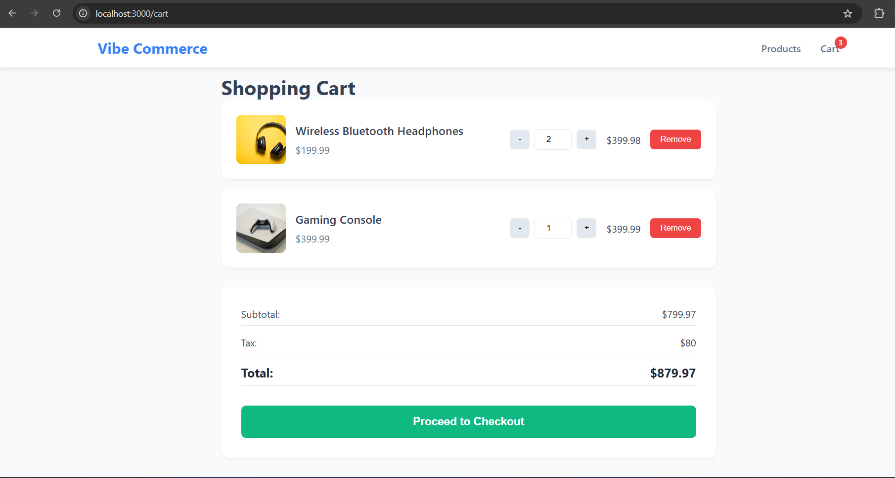
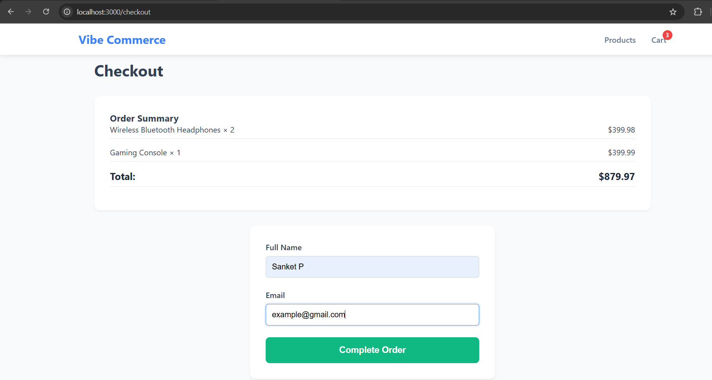

> **NOTICE:** This project is proprietary. The source code is published for
> demonstration and recruitment purposes only. Reuse, distribution, or
> modification is prohibited without written permission from Sanket S Patwalkar.

# 🛒 Vibe Commerce - Mock E-Commerce Cart

A **full-stack mock shopping cart app** built for the Vibe Commerce internship screening using **React**, **Node.js**, **Express**, and **SQLite**.

---

## 🎥 Demo Video:
https://youtu.be/Yqrwbnhjvl8

## 🚀 Features
- Product catalog with prices, descriptions & images  
- Add, remove, and update items in the cart  
- Checkout form with validation & receipt generation  
- Responsive UI for all devices  
- Persistent data with SQLite

---

## 🛠 Tech Stack
**Frontend:** React 18, Vite, React Router, CSS3  
**Backend:** Node.js, Express.js, SQLite3, CORS

---

## 📁 Structure
```
mock-ecom-cart/
├── backend/
│   ├── server.js
│   ├── routes/
│   ├── models/
│   ├── db/
│   └── package.json
├── frontend/
│   ├── src/
│   │   ├── components/
│   │   ├── pages/
│   │   └── App.jsx
│   └── package.json
└── README.md
```

---

## ⚙️ Setup & Run
### 1️⃣ Backend
```
cd backend
npm install
npm start
```
Runs on **http://localhost:5000**

### 2️⃣ Frontend
```
cd frontend
npm install
npm run dev
```
Runs on **http://localhost:3000**

---

## 📡 API Overview
| Method | Endpoint | Description |
|--------|-----------|-------------|
| GET | /api/products | Get all products |
| POST | /api/cart | Add item to cart |
| DELETE | /api/cart/:id | Remove item |
| GET | /api/cart | Get cart + total |
| POST | /api/checkout | Mock checkout & receipt |

---

## Screenshots
### Product Home Page


### Cart Page


### Checkout Page


### Order Confirmed 


## 🧩 Database Schema
**Products:** id, name, price, description, image  
**Cart:** id, productId, qty, unitPrice, lineTotal  
**Receipts:** receiptId, items(JSON), total, name, email, timestamp

---

## 🎯 Highlights
✅ RESTful API integration  
✅ Local SQLite persistence  
✅ Responsive and modern UI  
✅ Error handling & validation  
✅ Mock checkout receipt  

---

## 🧪 Testing (Example)
```bash
GET http://localhost:5000/api/products
POST http://localhost:5000/api/cart {"productId":"p1","qty":1}
POST http://localhost:5000/api/checkout {"name":"John","email":"john@example.com"}
```

---

## 🏁 Conclusion
A compact, efficient **mock e-commerce cart** demonstrating end-to-end integration between UI, API, and DB — fulfilling all Vibe Commerce requirements.
